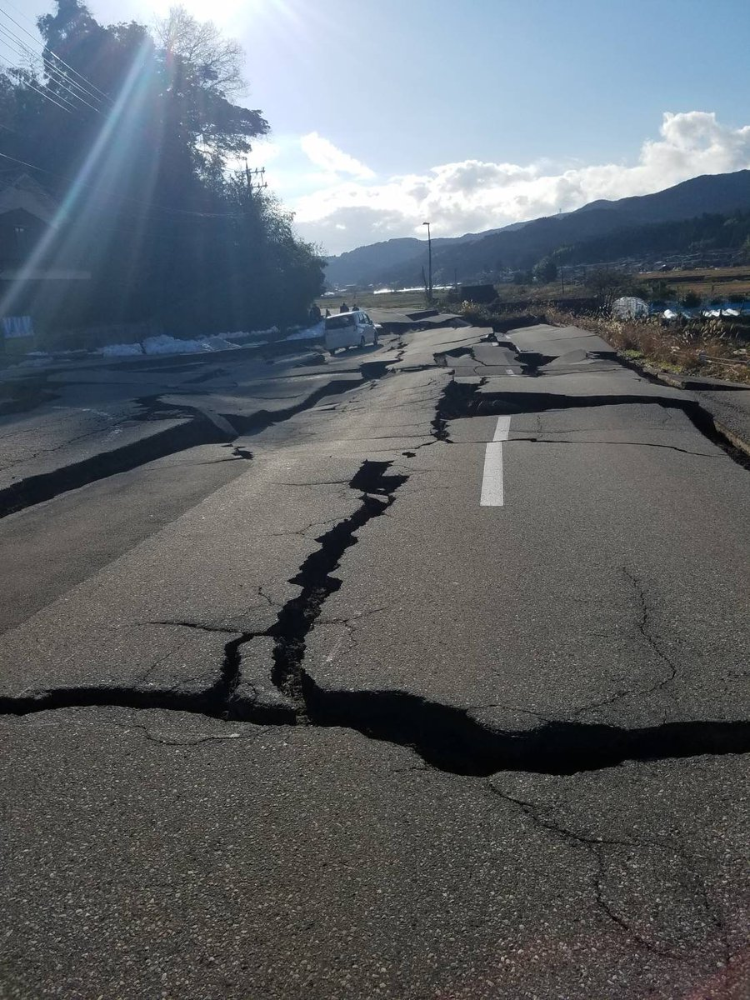
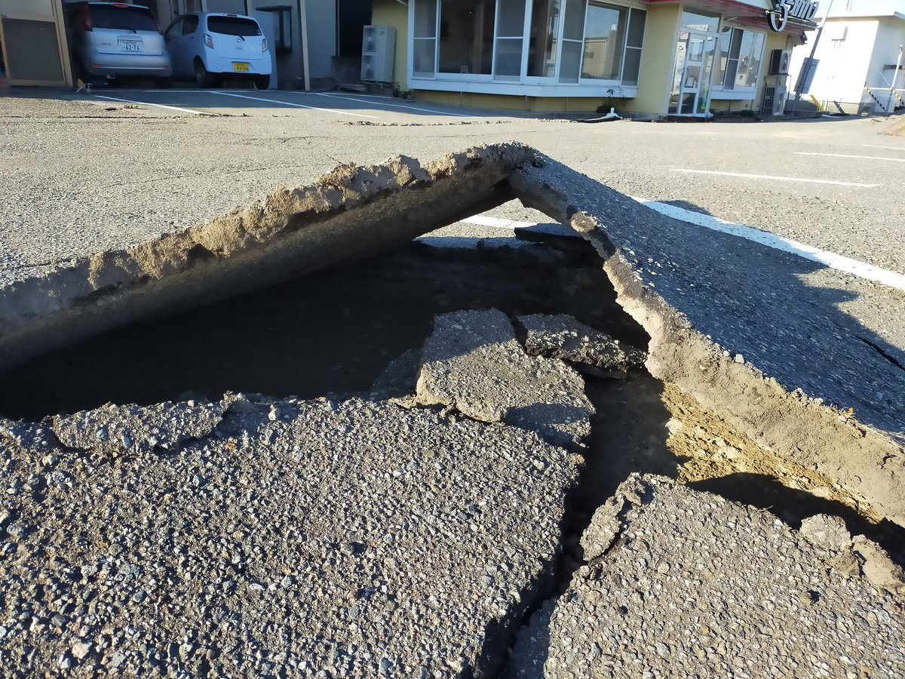
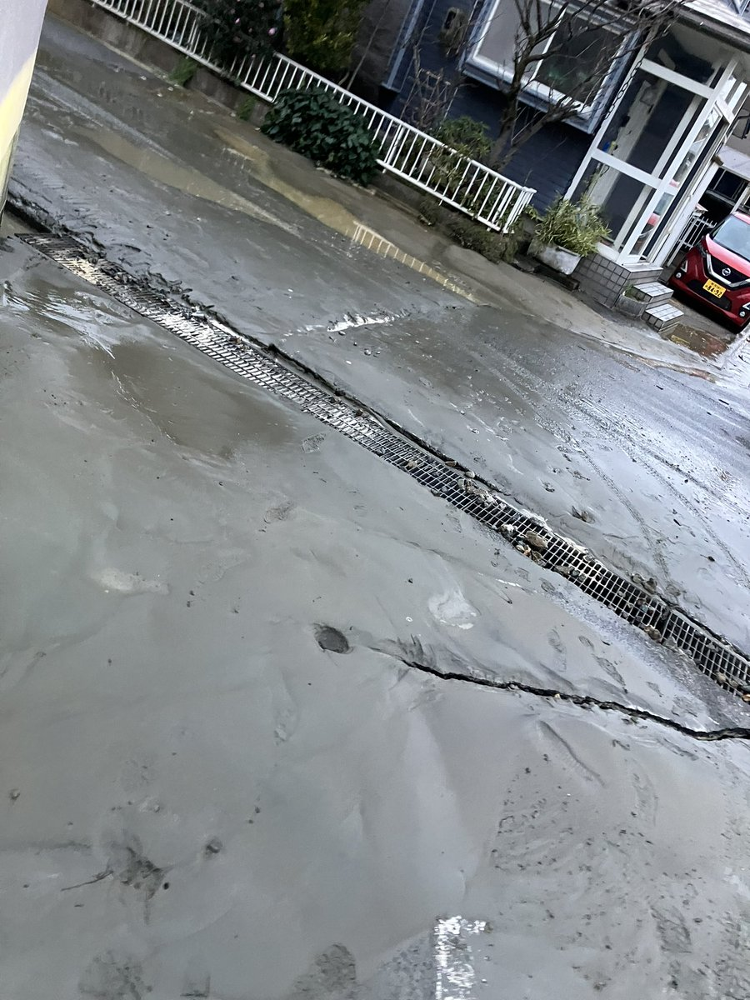

# 発表用デモ 回答候補レビュー

- 収集日時: 2026-08-29T08:29:38.788661+00:00
- モデル: `qwen/qwen3.6-35b-a3b`
- モード: 震度=`mock`、被害特徴量=`mock`
- 回答原文・計算state: [responses.json](responses.json)

## 自動確認結果

| 住所 | 補償額 | 震度 | FASTALERT言及 | 数式固定 | 写真保存 |
|---|---:|---:|:---:|:---:|:---:|
| 輪島市 河井町1部115番地 | 約309万円 | 7 | ✓ | ✓ | ✓ |
| 内灘町 大学1丁目2番地1 | 約60万円 | 5弱 | × | ✓ | ✓ |
| 長岡市 中之島1993番地17 | 約36万円 | 6弱 | ✓ | ✓ | ✓ |

## 輪島市 河井町1部115番地

- 入力住所: `石川県輪島市河井町1部115番地`
- ジオコード結果: `石川県輪島市河井町１番`
- 画像カテゴリ: 道路損壊
- 画像出典: [元投稿](https://twitter.com/misakura_rin/status/1742111283472973918) / [FASTALERT](https://app.fastalert.jp/domestic/disaster/9385040)

### 補償額

入力:

> 能登半島地震における石川県輪島市河井町1部115番地の補償額を教えてください

回答:

補償額は**3,091,005円**です。

### 平易な根拠

入力:

> この補償額になった根拠を教えてください

回答:

この地域は**震度7相当**の極めて激しい揺れに見舞われました。
**FASTALERT**で収集した被害投稿の情報を見ると、倒壊や道路被害、救助要請に関する情報が目立ちました。
補償額の算定では、揺れの強さだけでなく、**地盤変状**といった被害の状況も反映しています。
これらの情報を総合的に評価した結果、法人契約の**保険金額(1,000万円)に対して約31%**を支払う水準と判断し、**約309万円**という補償額を算出しました。

### 数式による根拠

入力:

> 数式を使って理由を説明してください

回答:

**計算の内訳**

支払率を求める基本式です。

$$p = \frac{1}{1 + \exp(-z)}$$

$$z = w_0 + w_1 S_i + \sum_k w_k x_k$$

- 震度スコア: $S_i=6.75$
- 切片: $w_0=-14.85$
- 震度の重み: $w_1=2.00$
- 被害特徴量の重み: 液状化 0.24、地盤変状 0.72
- 被害特徴量の寄与: 液状化 0.00、地盤変状 0.52

震度と被害特徴量の寄与を合計します。

$$w_1 S_i \approx 13.53$$

$$\sum_k w_k x_k \approx 0.52$$

$$z \approx -14.85 + 13.53 + 0.52$$

$$z \approx -0.80$$

丸め前の値で算出した支払率です。

$$p \approx 30.91\%$$

法人契約の保険金額に支払率を掛けます。

$$P \approx 10,000,000 \times 30.91\%$$

$$P = 3,091,005\text{円}$$

したがって、補償額は**約309万円**です。表示値は小数第3位で四捨五入していますが、補償額は丸め前の値で計算しています。

### 被害写真

入力:

> 写真で被害の状況を教えてください

回答:

*輪島市・カテゴリ「道路損壊」の被害投稿画像([出典](https://twitter.com/misakura_rin/status/1742111283472973918))*

これが補償額算定で影響が大きかった地盤変状に対応する実際の投稿画像です。

## 内灘町 大学1丁目2番地1

- 入力住所: `石川県河北郡内灘町字大学1丁目2番地1`
- ジオコード結果: `石川県内灘町大学一丁目２番地`
- 画像カテゴリ: 液状化
- 画像出典: [元投稿](https://twitter.com/Wizard_of_Oz__/status/1742088391234408549) / [FASTALERT](https://app.fastalert.jp/domestic/disaster/9384267)

### 補償額

入力:

> 能登半島地震における石川県河北郡内灘町字大学1丁目2番地1の補償額を教えてください

回答:

補償額は**597,363円**です。

### 平易な根拠

入力:

> この補償額になった根拠を教えてください

回答:

この地域は震度5弱相当の揺れに見舞われました。

SNS等から集めた被害投稿を見ると、液状化や倒壊に関する被害情報が目立ちました。

補償額の算定では、揺れの強さとこうした被害状況を総合的に評価しました。その結果、法人契約の保険金額（1,000万円）に対して約6%を支払う水準と判断し、**約60万円**という補償額を算出しました。

### 数式による根拠

入力:

> 数式を使って理由を説明してください

回答:

**計算の内訳**

支払率を求める基本式です。

$$p = \frac{1}{1 + \exp(-z)}$$

$$z = w_0 + w_1 S_i + \sum_k w_k x_k$$

- 震度スコア: $S_i=4.75$
- 切片: $w_0=-14.85$
- 震度の重み: $w_1=2.00$
- 被害特徴量の重み: 液状化 0.24、地盤変状 0.72
- 被害特徴量の寄与: 液状化 2.57、地盤変状 0.00

震度と被害特徴量の寄与を合計します。

$$w_1 S_i \approx 9.52$$

$$\sum_k w_k x_k \approx 2.57$$

$$z \approx -14.85 + 9.52 + 2.57$$

$$z \approx -2.76$$

丸め前の値で算出した支払率です。

$$p \approx 5.97\%$$

法人契約の保険金額に支払率を掛けます。

$$P \approx 10,000,000 \times 5.97\%$$

$$P = 597,363\text{円}$$

したがって、補償額は**約60万円**です。表示値は小数第3位で四捨五入していますが、補償額は丸め前の値で計算しています。

### 被害写真

入力:

> 写真で被害の状況を教えてください

回答:

*内灘町・カテゴリ「液状化」の被害投稿画像([出典](https://twitter.com/Wizard_of_Oz__/status/1742088391234408549))*

これが補償額算定で影響が大きかった被害カテゴリの実際の投稿画像です。

## 長岡市 中之島1993番地17

- 入力住所: `新潟県長岡市中之島1993番地17`
- ジオコード結果: `新潟県長岡市中之島１９９３番地`
- 画像カテゴリ: 液状化
- 画像出典: [元投稿](https://twitter.com/Arianrod_kazuki/status/1741724102434730447) / [FASTALERT](https://app.fastalert.jp/domestic/disaster/9379288)

### 補償額

入力:

> 能登半島地震における新潟県長岡市中之島1993番地17の補償額を教えてください

回答:

補償額は**364,946円**です。

### 平易な根拠

入力:

> この補償額になった根拠を教えてください

回答:

この地域は**震度6弱相当**の激しい揺れに見舞われました。

補償額を算出する際は、揺れの強さに加えて**FASTALERT**で収集されたSNS投稿等の被害状況が反映されます。FASTALERTでは、倒壊や断水、特に**液状化**に関する被害情報が目立ちました。

揺れの強さとこうした被害状況を総合的に評価した結果、法人契約の保険金額（1,000万円）に対して約4%の割合で計算され、**約36万円**という補償額となりました。

### 数式による根拠

入力:

> 数式を使って理由を説明してください

回答:

**計算の内訳**

支払率を求める基本式です。

$$p = \frac{1}{1 + \exp(-z)}$$

$$z = w_0 + w_1 S_i + \sum_k w_k x_k$$

- 震度スコア: $S_i=5.75$
- 切片: $w_0=-14.85$
- 震度の重み: $w_1=2.00$
- 被害特徴量の重み: 液状化 0.24、地盤変状 0.72
- 被害特徴量の寄与: 液状化 0.05、地盤変状 0.00

震度と被害特徴量の寄与を合計します。

$$w_1 S_i \approx 11.52$$

$$\sum_k w_k x_k \approx 0.05$$

$$z \approx -14.85 + 11.52 + 0.05$$

$$z \approx -3.27$$

丸め前の値で算出した支払率です。

$$p \approx 3.65\%$$

法人契約の保険金額に支払率を掛けます。

$$P \approx 10,000,000 \times 3.65\%$$

$$P = 364,946\text{円}$$

したがって、補償額は**約36万円**です。表示値は小数第3位で四捨五入していますが、補償額は丸め前の値で計算しています。

### 被害写真

入力:

> 写真で被害の状況を教えてください

回答:

*長岡市・カテゴリ「液状化」の被害投稿画像([出典](https://twitter.com/Arianrod_kazuki/status/1741724102434730447))*

これが補償額算定で影響が大きかった「液状化」被害カテゴリの実際の投稿画像です。
